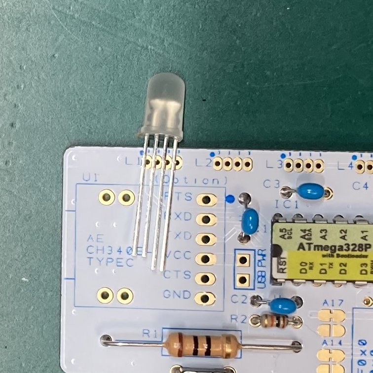
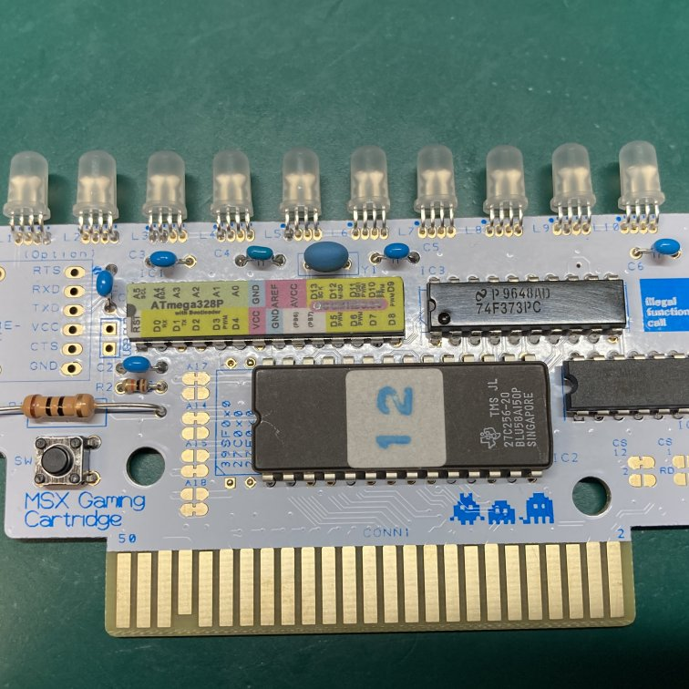
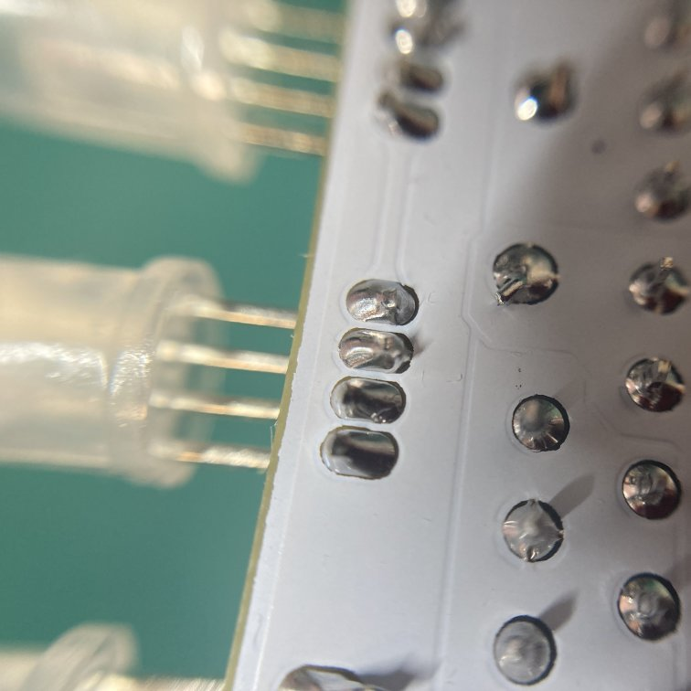

# MSX Gaming LED Cartridge 組み立てマニュアル

## パーツ一覧

### ■フルキット版  

組み立てに必要なパーツは下記の通りです。  
最低限の動作に必要なパーツは同梱してあります。不足があった場合は連絡お願いします。  

### 付属部品一覧

|Ref No|Part Name.|Qty|備考|
| :- |  :- |  :- |  :- |
|－|専用PCB|1||
|U1|Pin Header 6P|1|通常は未実装、Serialユニット接続時に使用|
|IC1|Microchip ATMEGA328P-PU|1|Bootloaderとファームウェア書き込み済|
|C1-6|積層セラミックコンデンサー0.1uf 50V|6||
|IC4|TC74HC00AP (同等品)|1|　|
|IC3|TC74HC373P (同等品)|1|　|
|Y1|村田 CSTLS16M0X53-B0|1|セラロック１６ＭＨｚ|
|L1-10|PL9823-F5|10|マイコン内蔵RGB LED 5mm |
|R2|100KΩ 1/6W|1||
|R1|10Ω 1W |1|　|
|IC2| 27C256 (同等品) |1|拡張BASIC書き込み済
|SW1| OMRON B3F-1020 |1|

### ■ 基板＋EPROM版

基板の他に書き込みが難しいUV-EPROMが付属しています  

その他、部品は別途購入する必要があります。秋月電子で揃える事が可能です。  
通販コードを明記してありますので通販で揃えても良いと思います。  

AVRマイコンへのファームウェア書き込みが必要なのでArduinoの実行環境とUSBシリアルユニット必要です。  
また、Arduino Bootloaderの事前書き込みが必要です。（秋月電子では書き込み済を販売しています）  

### 付属部品一覧

|Ref No|Part Name.|Qty|備考|
| :- |  :- |  :- |  :- |
|－|専用PCB|1||
|IC2| 27C256 (同等品) |1|拡張BASIC書き込み済

### 秋月電子お買い物リスト

下記パーツを一括で秋月電子のカートに入れる →[PartsCabi.netのページへ](https://partscabi.net/list/a1651c81-8f59-4dd2-ab42-5e0de5e76d7f)

|Ref No|通販コード|商品名(秋月電子)|Qty|参考価格(2023/2)|備考|
| :- |  :- |  :- |  :- |  :- |  :- |
|U1|K-14745|AE-CH340E-TYPEC|1|￥550|類似品を持っている場合は購入不要|
|U1|C-05336|ピンヘッダ　（Ｌ型）　１×６　（６Ｐ）|1|￥10|Serialユニットを取り外し式にする場合は必要|
|IC1|I-12774|Ａｒｄｕｉｎｏ　Ｂｏｏｔｌｏａｄｅｒ書込済（５Ｖ　１６ＭＨｚ仕様）ＡＴｍｅｇａ３２８Ｐ"|1|￥400|5V仕様を購入すること Bootloaderが自力で書ける人は単体デバイスでOK|
|C1-6|P-13582|積層セラミックコンデンサー０．１μＦ５０Ｖ　Ｘ７Ｒ　２．５４ｍｍ　（１０個入）|6|￥100||
|IC4|I-14052|４回路２入力ＮＡＮＤ　Ｕ７４ＨＣ００Ｌ－Ｄ１４－Ｔ|1|￥20|I-10856　TC74HC00APもOK|
|IC3|I-13348|８回路入３ステートラッチ　７４Ｆ３７３　（１０個入）|1|￥100||
|Y1|P-09576|セラミック発振子（セラロック）コンデンサー内蔵タイプ　１６ＭＨｚ|1|￥35||
|L1-10|I-08411|マイコン内蔵ＲＧＢＬＥＤ　５ｍｍ　ＰＬ９８２３－Ｆ５|10|￥400| PL9823-F8でもOK|
|R2|R-16103|カーボン抵抗（炭素皮膜抵抗）１／６Ｗ１０ｋΩ　（１００本入）|1|￥100||
|R1|R-07956|カーボン抵抗（炭素皮膜抵抗）１Ｗ１０Ω　（１００本入）|1|￥200|1W以上の抵抗を必ず使ってください。|
|SW1|P-11243|タクトスイッチ　アルプス製 ※余分な足を切って使ってください|1|￥10|スイッチの高さに注意してください P-03647 タクトスイッチはケースに入らないです。"|

## ■ 基板の組み立て

セオリー通り背の低い部品から半田付けしてください。  
ICソケットを使うとケースに入らなくなるので注意してください。  

### 1．カードエッジをマスキングテープなどで端子保護します（推奨）  

  

### 2．R2/C1-6を実装します  

  

### 3．Y1/R1/SW1を実装します  

  

R1は多少発熱するので、PCBから多少浮かし実装してください。  
  

### 4．IC1-4を実装します  

  

### 5．L1-10を実装します  

LEDの実装は後から曲げるやり方(左)と前もって曲げるやり方(右)があります。  
  

#### 後から曲げる場合

足が短い方向がDOT側(左)、欠けている側が右になります。  
仕上がりに影響があるので、実装時は膨らみが引っかかる所まで挿入してください。 
    

すべてのLEDが実装したら90度に曲げてください。根元から1mm程度の所で曲がります。  
曲げるときにできるだけ、それぞれの位置が揃う様にすると仕上がりが綺麗です。  
      

#### 先に曲げる場合

膨らみがある下であらかじめ足を90度に曲げておきます。  
足が短い方向がDOT側(左)、欠けている側が右になります。  
LEDの足が基板と同じ高さになる様に実装していきます。  
それぞれの位置が揃う様に調整しながら実装すると仕上がりが綺麗です。  
     

### 6．U1にシリアルユニットまたはジャンパを実装します(オプション)  

  

### 7．完成！  

組み立て完了です。実機に挿す前に必ずショートチェックを実施してください。 
  

ケースに入れる場合Y1を少し曲げて、ケースに当たらない様にしてください。   

  

## ショートチェック

実機に挿す前にショートが無いか良く確認してください。  
テスタを持っているのであれば、写真の位置でVCC-GNDおよびLED電源のショートチェックを行ってください。  
 

## Arduinoスケッチの書き込み (基板＋EPROM版 購入者のみ）

USBシリアルを接続後、MSXに挿入してCartridgeに電源を入れてください。  
(AE-CH340Eを使わない場合はRXD/TXDを接続してください)  

スロットの形状によっては、ケーブルを接続したままで挿入出来ない場合があります。  
その場合は、近傍にあるUSB PWRのジャンパをショートさせUSBから電源供給をしてください。  
（5VがMSXに流れ込むので、書き込み後はオープンに戻してください）

Arduinoのインストールや細かい使い方はここでは割愛します。  
ボード選択はArduino UNO、COMポートはUSBシリアルの番号を選択してください。  
「マイコンボードに書き込む」のアイコンをクリックし、プログラムの書き込みを完了してください。  
  

## 動作チェック  

出荷状態であれば、電源を入れると自動的にLEDのデモパターン0～4が実行されます。  

### LEDが光らない/一部が光らない場合

大抵はLED部の半田付け不良です。R1が熱くなる場合は、L1-10のいずれかがショートしています。  
特に、LED部の4つのパッドの真ん中2つがショートしやすいです。そこを確認してみてください。  
 

### MSX本体が起動しない場合

IC2/IC3/IC4のいずれかの実装不良の可能性があります。  

