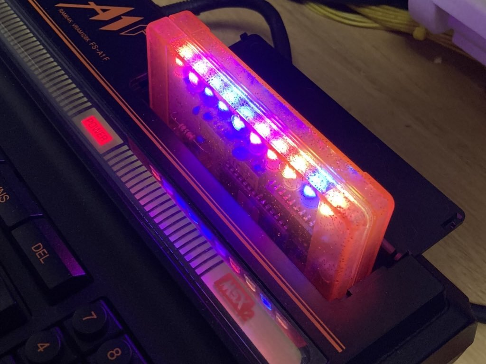

# MSX Gaming LED Cartridge  

  
  

  

MSX Gaming LED Cartridgeは10個のRGB LEDを搭載した、Party Nightなカセットです。  
MSX本体から拡張されたBASIC命令により10コのLEDは個別に点灯や色、点滅などのコントロールができ、  
本体のコントロールなしで簡単なアニメーションをさせることができます。

## ■ 使用イメージ

   
    

動画については下記URLを参照してください。  
<https://twitter.com/i/status/1623682455151706112>

## ■ 対応ソフトについて   
2023/2月現在下記ソフトが対応しています。

MGSP2(HRA!氏作)  
<https://github.com/hra1129/mgsp2/tree/main/dos2_version>  

## ■ 頒布について   

本製品は半田付けが必要なキット形式の頒布になります。  

Boothおよび家電のKENちゃんにて近日販売予定です。  
(Boothの発送は、週末にまとめて発送になるため、お急ぎの方は他ショップを利用ください)

配布の形態は、下記3形態になります。  

#### フルキット（基板 ＋ プログラム書き込み済みEPROM ＋その他パーツ）
必要なパーツも、すべてセットになったキットです。  

#### 基板＋ROMセット（基板 ＋ プログラム書込済EPROM ＋秋月電子のお買い物メモ）  
基板とプログラム書込済のEPROMのセットです。その他のパーツは秋月電子などで揃える必要があります。  
AVRマイコンへのプログラム書き込みが必要ですのでArduinoの取り扱い経験が必要です。  

#### 基板のみ  
基板単体です。(Boothのみ取り扱い予定)

## ■ 頒布先   

### 家電のKENちゃん  

未定

### Booth: (週１回の発送)  
未定

## ■ BASIC拡張命令およびプログラムからの制御方法について

下記仕様書を参照ください。  

[LED拡張BASIC仕様書](./EXBASIC/led_exbasic.md)  
[MSXLED仕様書](./EXBASIC/msxled_bios.md)

使い方のサンプルは下記を参照してください。  
[BASIC Game Sample](https://github.com/v9938/MSX_GamingLED/tree/main/SampleGame)  
[BASIC/MSX-DOS Sample](https://github.com/v9938/MSX_GamingLED/tree/main/SampleApplication)  

## ■ 組み立て説明書について  
下記を参照ください。  

[組み立て説明書](./AssemblyManual/Assembly.md)

## ■ 対応カートリッジシェルについて
KONAMI基板に対応しているシェルが使用できます。  
当方が頒布しているRGRさんおよび韓国製のCartridge Shellで使える事を確認しています。  
委託先で購入が可能です。  

LEDの点灯が見えないので透明/半透明シェルを推奨します。

## ■ おまけソフト  

MSXTurboRでは[2]キーを押す事で非対応ソフトをR800高速モードで起動させることが可能です。  
ROMカセットで使用する場合、スロット番号の若い方に本カセットを挿入してください。  

## ■ 本機の仕様について

|仕様  | 詳細 |
| - | - |
| 対応規格 | MSX標準スロット規格 |
| 使用LED | PL9823/YF923 x10 |
| 搭載マイコン | Atmel ATMEGA328P (Arduino 5v 16MHz仕様) |
| 定格 | 5V 250mA |
